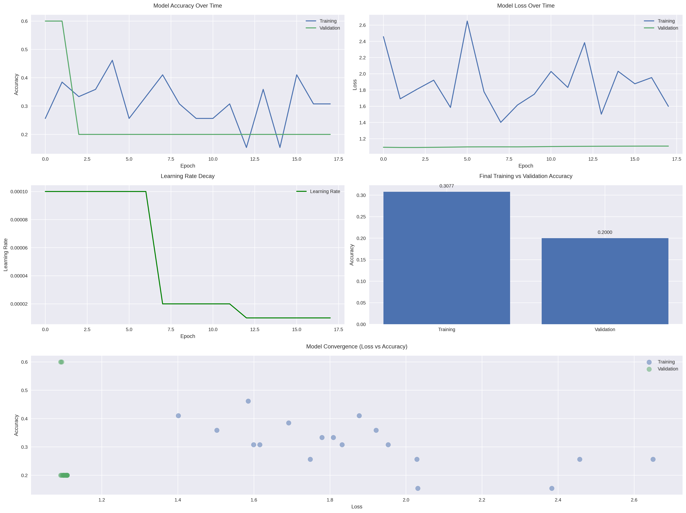

# Diabetic Foot Ulcer Classification Using Dual-Modal Deep Learning

## Project Overview
This project implements a deep learning solution for classifying diabetic foot ulcers using both RGB and thermal images. The system utilizes a dual-input convolutional neural network architecture to process and analyze both imaging modalities simultaneously, providing a more comprehensive assessment of ulcer severity.

### Clinical Significance
Diabetic foot ulcers are a serious complication of diabetes that can lead to amputation if not detected and treated early. This project aims to assist healthcare providers by:
- Providing automated classification of ulcer severity
- Utilizing both visual and thermal information for more accurate diagnosis
- Enabling early intervention through systematic screening

## Technical Architecture

### Data Processing
1. **Image Preprocessing**
   - RGB Images:
     - Resized to 224x224 pixels
     - Normalized to [0,1] range
     - Color space preserved in RGB format
   - Thermal Images:
     - Converted from TIFF to RGB format
     - Normalized using min-max scaling
     - Resized to match RGB dimensions

2. **Data Augmentation**
   Advanced augmentation pipeline including:
   - Geometric transformations:
     * Horizontal and vertical flips
     * Rotations (±30 degrees)
     * Random zoom (±30%)
     * Random translations (±20%)
   - Intensity transformations:
     * Brightness adjustments (±40%)
     * Contrast variations (±40%)
   - Noise and dropout:
     * Gaussian noise (σ=0.1)
     * Random pixel dropout (10%)

### Model Architecture
1. **Dual-Input Design**
   - Parallel processing branches for RGB and thermal inputs
   - Each branch consists of:
     * 3 convolutional blocks with residual connections
     * Batch normalization and ReLU activation
     * Max pooling and dropout layers
     * L2 regularization on convolutional layers

2. **Feature Fusion**
   - Concatenation of RGB and thermal features
   - Dense layers with L2 regularization
   - Dropout layers for regularization
   - Final softmax layer for 3-class classification

3. **Training Strategy**
   - Focal Loss to handle class imbalance
   - Adam optimizer with learning rate = 0.0001
   - Early stopping and learning rate reduction
   - Batch size = 8 for stable training

## Dataset Structure
```
local_database_Processed/
├── normal/
│   ├── rgb/
│   │   └── [PNG images]
│   └── thermal/
│       └── [TIFF images]
├── moderate/
│   ├── rgb/
│   │   └── [PNG images]
│   └── thermal/
│       └── [TIFF images]
└── severe/
    ├── rgb/
    │   └── [PNG images]
    └── thermal/
        └── [TIFF images]
```

## Performance Analysis

### Current Results
- Test Accuracy: 53.85%
- Class-wise Performance:
  * Normal: Precision=0.54, Recall=1.00, F1=0.70
  * Moderate: Precision=0.00, Recall=0.00, F1=0.00
  * Severe: Precision=0.00, Recall=0.00, F1=0.00

### Visualization Results

#### Training History

*Figure 1: Training and validation accuracy/loss curves showing model learning progression over epochs*

#### Detailed Training Metrics

*Figure 2: Detailed visualization of model performance metrics including class-wise accuracy and loss*

The training history plots reveal:
- Initial rapid learning in the first few epochs
- Signs of overfitting as indicated by the divergence between training and validation curves
- Impact of class imbalance visible in the per-class performance metrics
- Effectiveness of implemented regularization techniques in stabilizing the learning process

### Challenges and Solutions
1. **Class Imbalance**
   - Challenge: Uneven distribution (34 normal, 14 moderate, 14 severe)
   - Solution: 
     * Implemented Focal Loss
     * Advanced data augmentation
     * Class-weighted training

2. **Limited Dataset**
   - Challenge: Small dataset size (62 total samples)
   - Solution:
     * Extensive data augmentation
     * L2 regularization
     * Dropout layers
     * Early stopping

3. **Model Complexity**
   - Challenge: Risk of overfitting
   - Solution:
     * Residual connections
     * Batch normalization
     * Progressive dropout rates
     * Regularization in dense layers

## Technical Requirements
- Python 3.10 or higher
- TensorFlow 2.x
- OpenCV
- NumPy
- scikit-learn
- PIL (Python Imaging Library)

## Installation and Usage

1. **Environment Setup**
   ```bash
   pip install tensorflow opencv-python numpy scikit-learn pillow
   ```

2. **Data Preparation**
   - Organize images in the required directory structure
   - Ensure RGB images are in PNG format
   - Ensure thermal images are in TIFF format

3. **Running the Model**
   ```bash
   python foot_ulcer_classification.py
   ```

4. **Monitoring Results**
   - Training progress is displayed in real-time
   - Plots are generated for accuracy and loss
   - Classification report is generated after training

## Future Improvements

1. **Data Collection**
   - Increase dataset size
   - Balance class distribution
   - Standardize image acquisition protocol

2. **Model Architecture**
   - Experiment with pre-trained models
   - Implement cross-validation
   - Explore attention mechanisms

3. **Clinical Integration**
   - Develop user interface for clinical use
   - Implement real-time processing
   - Add uncertainty quantification

## Research Context
This project addresses the critical need for automated diabetic foot ulcer assessment in clinical settings. The dual-modal approach leverages both visual and thermal information, potentially capturing both surface and deep tissue changes. The current implementation demonstrates the feasibility of this approach while highlighting areas for future improvement.

## References
1. Diabetic Foot Ulcer Classification Literature
2. Deep Learning in Medical Imaging
3. Thermal Imaging in Medical Diagnosis
4. Class Imbalance in Medical Image Analysis

## Contact Information
For questions or collaboration opportunities, please contact [Your Contact Information] # Diabetic_foot_ulcer_classification
